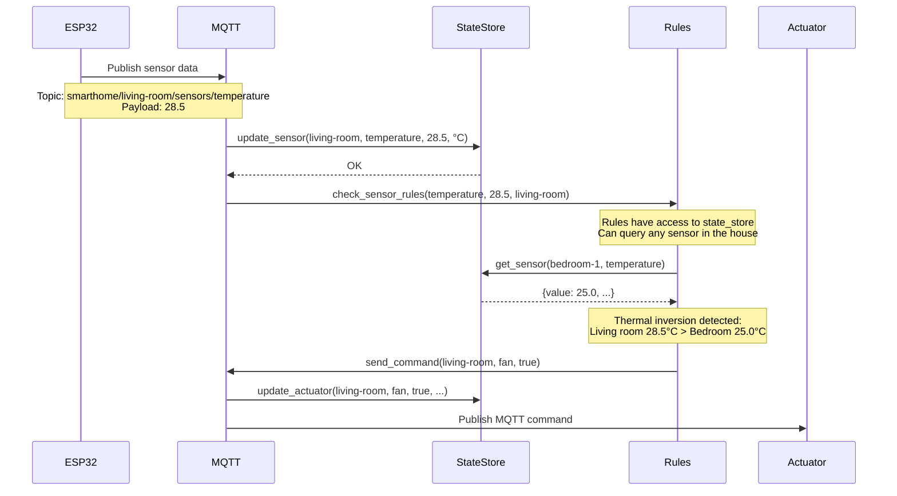
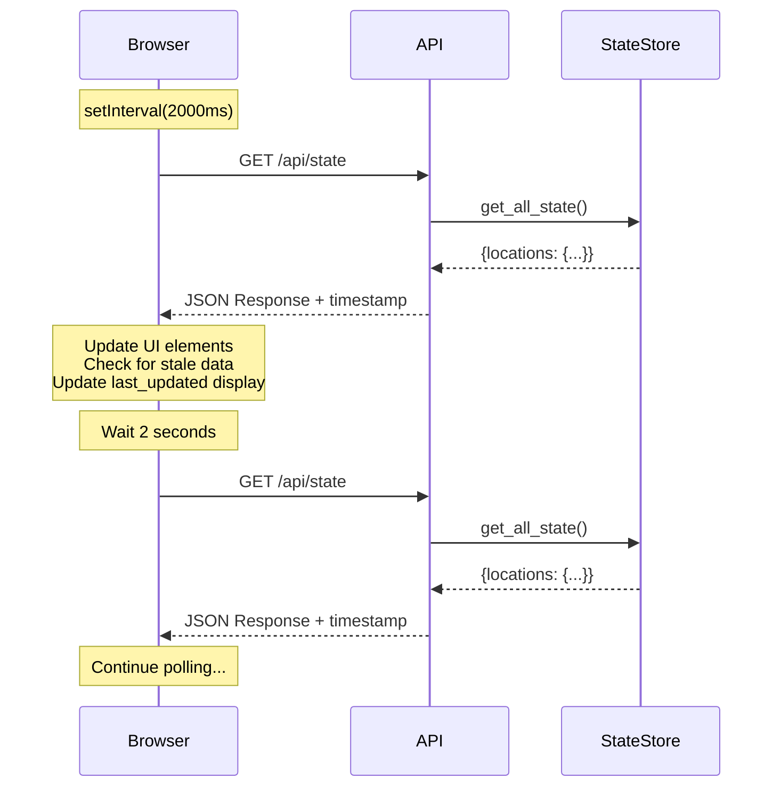
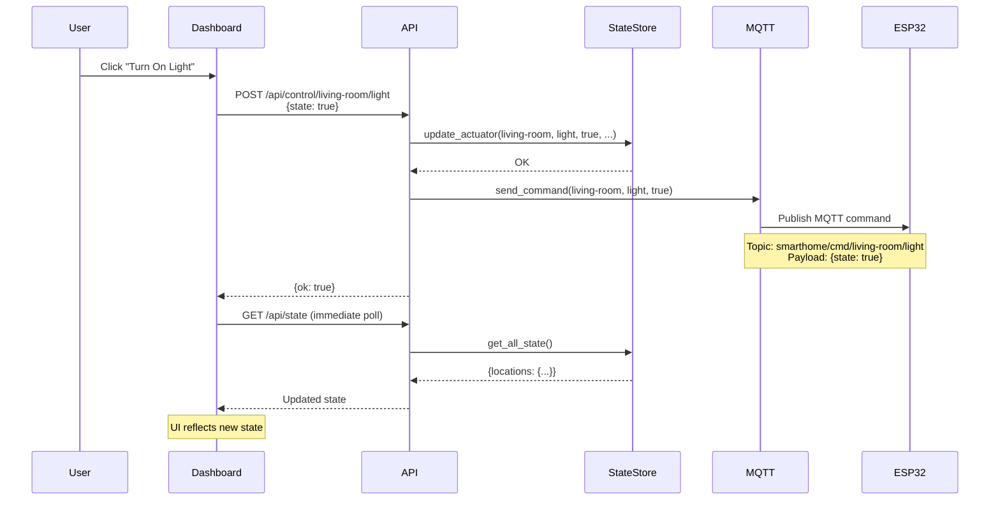
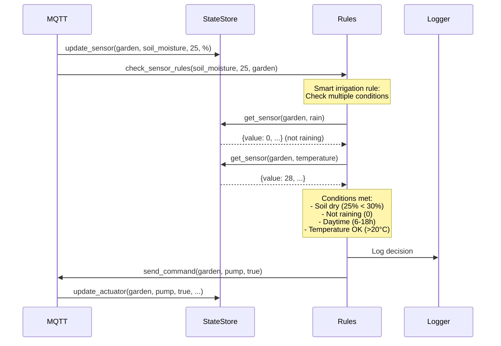

# Design Document: Simple Project - State Store Architecture

## Overview

Feature này cải thiện kiến trúc Smart Home Hub bằng cách thay thế database-centric approach bằng in-memory State Store. Mục tiêu là tạo ra hệ thống nhẹ hơn, nhanh hơn, phù hợp với server yếu (Raspberry Pi) và đơn giản hóa rules engine để hỗ trợ logic phức tạp.

### Key Changes

1. **In-Memory State Store**: Lưu trữ trạng thái latest của tất cả sensors và actuators trong memory
2. **Enhanced Rules Engine**: Rules nhận full context (state_store) để viết logic phức tạp
3. **Remove WebSocket**: Chuyển sang REST API polling đơn giản hơn
4. **No Database**: Loại bỏ SQLite và SQLAlchemy dependencies
5. **Thread-Safe Operations**: Đảm bảo an toàn khi truy cập đồng thời từ MQTT và API threads
6. **Location-Based Architecture**: Sử dụng `location_id` thay vì `device_id` (1 ESP32 có thể điều khiển nhiều phòng)
7. **Floor Support**: Thêm khái niệm tầng (floor) để điều khiển theo nhóm tầng

### Benefits

- **Performance**: Truy cập state từ memory thay vì database queries
- **Simplicity**: Ít dependencies, dễ deploy và maintain
- **Flexibility**: Rules có thể truy cập bất kỳ sensor nào trong nhà
- **Lightweight**: Phù hợp với Raspberry Pi và các server yếu

## Architecture

### High-Level Architecture

```
┌─────────────────────────────────────────────────────────────┐
│                      Smart Home Hub                          │
│                                                              │
│  ┌──────────────┐      ┌──────────────┐    ┌─────────────┐ │
│  │   MQTT       │─────▶│  State Store │◀───│  REST API   │ │
│  │   Service    │      │  (In-Memory) │    │  Endpoints  │ │
│  └──────────────┘      └──────────────┘    └─────────────┘ │
│         │                      │                    │        │
│         │                      ▼                    │        │
│         │              ┌──────────────┐             │        │
│         └─────────────▶│ Rules Engine │             │        │
│                        │  (Enhanced)  │             │        │
│                        └──────────────┘             │        │
│                                                      │        │
└──────────────────────────────────────────────────────┼────────┘
                                                       │
                                                       ▼
                                              ┌─────────────────┐
                                              │   Dashboard     │
                                              │   (Polling)     │
                                              └─────────────────┘
```

### Data Flow

#### Sensor Data Flow
```
ESP32 Device
    │
    │ MQTT: smarthome/{location_id}/sensors/{sensor_type}
    ▼
MQTT Service
    │
    ├─▶ Update State Store (immediate)
    │
    └─▶ Rules Engine (with state_store context)
            │
            └─▶ Actions (if rules triggered)
```

#### Dashboard Polling Flow
```
Dashboard (Browser)
    │
    │ setInterval(2000ms)
    ▼
GET /api/state
    │
    ▼
Read from State Store
    │
    ▼
Return JSON Response
    │
    ▼
Update UI
```

#### Actuator Control Flow
```
Dashboard / API Client
    │
    │ POST /api/control/{location_id}/{actuator}
    ▼
API Endpoint
    │
    ├─▶ Update State Store
    │
    └─▶ Publish MQTT Command
            │
            ▼
        ESP32 Device
```

## Components and Interfaces

### 1. State Store (services/state_store.py)

Core component lưu trữ trạng thái in-memory của tất cả devices.

#### Class: StateStore

```python
class StateStore:
    """
    Thread-safe in-memory storage for device states
    
    Data Structure:
    {
        "locations": {
            "location_id": {
                "sensors": {
                    "sensor_type": {
                        "value": float,
                        "timestamp": datetime,
                        "unit": str
                    }
                },
                "actuators": {
                    "actuator_type": {
                        "state": bool,
                        "value": str,
                        "timestamp": datetime,
                        "updated_by": str
                    }
                }
            }
        }
    }
    """
    
    def __init__(self):
        """Initialize empty state store with thread lock"""
        pass
    
    def update_sensor(self, location_id: str, sensor_type: str, 
                     value: float, unit: str) -> None:
        """Update sensor reading (thread-safe)"""
        pass
    
    def update_actuator(self, location_id: str, actuator_type: str,
                       state: bool, value: str, updated_by: str) -> None:
        """Update actuator state (thread-safe)"""
        pass
    
    def get_sensor(self, location_id: str, sensor_type: str) -> dict:
        """Get specific sensor value"""
        pass
    
    def get_actuator(self, location_id: str, actuator_type: str) -> dict:
        """Get specific actuator state"""
        pass
    
    def get_all_sensors(self, location_id: str) -> dict:
        """Get all sensors for a location"""
        pass
    
    def get_all_actuators(self, location_id: str) -> dict:
        """Get all actuators for a location"""
        pass
    
    def get_location_state(self, location_id: str) -> dict:
        """Get complete state of a location"""
        pass
    
    def get_all_state(self) -> dict:
        """Get complete state of all locations"""
        pass
    
    def get_locations_by_floor(self, floor: str) -> list:
        """Get all location_ids on a specific floor"""
        pass
    
    def save_to_file(self, filepath: str) -> None:
        """Save state to JSON file (optional persistence)"""
        pass
    
    def load_from_file(self, filepath: str) -> None:
        """Load state from JSON file (optional persistence)"""
        pass
```

#### Thread Safety Implementation

```python
import threading
from datetime import datetime
from contextlib import contextmanager
from MY_DEVICES import LOCATIONS

class StateStore:
    def __init__(self):
        self._state = {"locations": {}}
        self._lock = threading.Lock()
        self._access_times = []  # For performance monitoring
    
    @contextmanager
    def _timed_lock(self):
        """Context manager for lock with timing"""
        start = datetime.now()
        self._lock.acquire()
        try:
            yield
        finally:
            duration = (datetime.now() - start).total_seconds() * 1000
            self._access_times.append(duration)
            if duration > 5:
                logger.warning(f"Lock held for {duration:.2f}ms")
            self._lock.release()
    
    def update_sensor(self, location_id, sensor_type, value, unit):
        with self._timed_lock():
            if location_id not in self._state["locations"]:
                self._state["locations"][location_id] = {
                    "sensors": {},
                    "actuators": {}
                }
            
            self._state["locations"][location_id]["sensors"][sensor_type] = {
                "value": value,
                "timestamp": datetime.utcnow().isoformat(),
                "unit": unit
            }
    
    def get_locations_by_floor(self, floor):
        """Get all location_ids on a specific floor"""
        with self._timed_lock():
            return [
                location_id 
                for location_id, location_data in LOCATIONS.items()
                if location_data.get("floor") == floor
            ]
```

### 2. Enhanced MQTT Service (services/mqtt_service.py)

Updated để tích hợp với State Store.

#### Changes to MQTTService

```python
class MQTTService:
    def __init__(self, app=None, state_store=None):
        self.client = None
        self.app = app
        self.state_store = state_store  # NEW: State Store reference
        self.connected = False
        self.rule_engine = None
    
    def init_app(self, app, state_store):
        self.app = app
        self.state_store = state_store  # NEW
        
        # Initialize rule engine with state_store
        from simple.rules_simple import SimpleRuleEngine
        self.rule_engine = SimpleRuleEngine(self, state_store)
        
        self._setup_client()
    
    def _save_sensor_reading(self, location_id, sensor_type, payload):
        """Process sensor data"""
        try:
            value = float(payload) if sensor_type not in ("rain", "door") else \
                    (1.0 if payload in ("1", "open") else 0.0)
            
            units = {
                "temperature": "°C",
                "humidity": "%",
                "light": "%",
                "soil_moisture": "%",
                "current": "A",
                "rain": "",
                "door": ""
            }
            
            # NEW: Update State Store instead of database
            self.state_store.update_sensor(
                location_id, 
                sensor_type, 
                value, 
                units.get(sensor_type, "")
            )
            
            logger.debug(f"[{location_id}] {sensor_type}: {value}")
            
            # Check automation rules with state_store context
            if self.rule_engine:
                self.rule_engine.check_sensor_rules(
                    sensor_type, value, location_id
                )
        
        except ValueError:
            logger.error(f"Invalid sensor value: {payload}")
    
    def send_command(self, location_id, actuator, state):
        """Send actuator command"""
        topic = f"smarthome/cmd/{location_id}/{actuator}"
        payload = {
            "state": state,
            "source": "hub",
            "timestamp": datetime.utcnow().isoformat()
        }
        
        # NEW: Update State Store
        self.state_store.update_actuator(
            location_id,
            actuator,
            state,
            str(state),
            "mqtt_service"
        )
        
        return self.publish(topic, payload)
```

### 3. Enhanced Rules Engine (simple/rules_simple.py)

Updated để nhận state_store và hỗ trợ complex rules.

#### Updated SimpleRuleEngine

```python
class SimpleRuleEngine:
    def __init__(self, mqtt_service, state_store):
        self.mqtt = mqtt_service
        self.state_store = state_store  # NEW: Full context access
        self.rules_enabled = True
    
    def check_sensor_rules(self, sensor_type, value, location_id):
        """Check rules with state_store context"""
        if not self.rules_enabled:
            return
        
        logger.info(f"Checking rules for {location_id}/{sensor_type}={value}")
        
        # Call user rules with state_store
        if USE_MY_RULES:
            try:
                sensor_rules(
                    self.mqtt,
                    self.state_store,  # NEW: Pass state_store
                    location_id,
                    sensor_type,
                    value
                )
            except Exception as e:
                logger.error(f"Error in MY_RULES.sensor_rules: {e}")
```

#### Updated MY_RULES.py Interface

```python
def sensor_rules(mqtt, state_store, location_id, sensor_type, value):
    """
    Rules with full context access
    
    Args:
        mqtt: MQTT service for sending commands
        state_store: State Store for querying any sensor/actuator
        location_id: Current location ID (phòng/khu vực)
        sensor_type: Current sensor type
        value: Current sensor value
    """
    
    # Example: Thermal inversion between rooms
    if sensor_type == "temperature" and location_id == "bedroom-1":
        # Get temperature from another room
        living_room_temp = state_store.get_sensor("living-room", "temperature")
        
        if living_room_temp and value < living_room_temp["value"] - 5:
            logger.info(f"Thermal inversion detected: "
                       f"Bedroom {value}°C < Living room {living_room_temp['value']}°C")
            # Turn on fan in living room to circulate air
            turn_on(mqtt, "living-room", "fan")
    
    # Example: Smart irrigation (multiple sensors)
    if sensor_type == "soil_moisture" and location_id == "garden":
        rain_sensor = state_store.get_sensor("garden", "rain")
        current_hour = datetime.now().hour
        
        # Only water if: soil dry + not raining + daytime
        if value < 30 and \
           (not rain_sensor or rain_sensor["value"] == 0) and \
           6 <= current_hour <= 18:
            logger.info("Smart irrigation: Soil dry, no rain, daytime → Water")
            turn_on(mqtt, "garden", "pump")
    
    # Example: Control all lights on a floor
    if sensor_type == "light" and value < 20:
        # Get floor of current location
        from MY_DEVICES import LOCATIONS
        floor = LOCATIONS.get(location_id, {}).get("floor")
        
        if floor:
            logger.info(f"Dark detected on {floor} floor → Turn on all lights")
            turn_on_all_lights_on_floor(mqtt, floor, state_store)


def time_rules(mqtt, state_store):
    """
    Time-based rules with full context
    
    Args:
        mqtt: MQTT service
        state_store: State Store for querying any sensor/actuator
    """
    now = datetime.now()
    hour = now.hour
    minute = now.minute
    
    # Example: Evening lights based on outdoor light level
    if hour == 18 and minute == 0:
        outdoor_light = state_store.get_sensor("garden", "light")
        
        if outdoor_light and outdoor_light["value"] < 30:
            logger.info("Evening + Dark outside → Turn on all lights")
            turn_on_all_lights_in_house(mqtt, state_store)
        else:
            logger.info("Evening but still bright → Wait")
    
    # Example: Turn off all lights on ground floor at night
    if hour == 23 and minute == 0:
        logger.info("23:00 → Turn off ground floor lights")
        turn_off_all_lights_on_floor(mqtt, "ground", state_store)
```

### 4. REST API Endpoints (routes/api.py)

New endpoints for state access.

#### New API Routes

```python
from flask import Blueprint, jsonify, request
from services.state_store import state_store
from services.mqtt_service import mqtt_service

api_bp = Blueprint("api", __name__)

@api_bp.route("/state", methods=["GET"])
def get_all_state():
    """
    GET /api/state
    Returns complete state of all locations
    
    Response:
    {
        "locations": {
            "living-room": {
                "sensors": {
                    "temperature": {"value": 28.5, "timestamp": "...", "unit": "°C"},
                    "humidity": {"value": 65, "timestamp": "...", "unit": "%"}
                },
                "actuators": {
                    "light": {"state": true, "value": "on", "timestamp": "...", "updated_by": "api"}
                }
            }
        },
        "timestamp": "2024-01-15T10:30:00Z"
    }
    """
    try:
        state = state_store.get_all_state()
        return jsonify({
            "locations": state["locations"],
            "timestamp": datetime.utcnow().isoformat()
        })
    except Exception as e:
        logger.error(f"Error getting state: {e}")
        return jsonify({"error": str(e)}), 500


@api_bp.route("/state/<location_id>", methods=["GET"])
def get_location_state(location_id):
    """
    GET /api/state/{location_id}
    Returns state of specific location
    
    Response:
    {
        "sensors": {...},
        "actuators": {...},
        "timestamp": "2024-01-15T10:30:00Z"
    }
    """
    try:
        state = state_store.get_location_state(location_id)
        
        if not state:
            return jsonify({"error": "Location not found"}), 404
        
        return jsonify({
            "sensors": state.get("sensors", {}),
            "actuators": state.get("actuators", {}),
            "timestamp": datetime.utcnow().isoformat()
        })
    except Exception as e:
        logger.error(f"Error getting location state: {e}")
        return jsonify({"error": str(e)}), 500


@api_bp.route("/state/floor/<floor>", methods=["GET"])
def get_floor_state(floor):
    """
    GET /api/state/floor/{floor}
    Returns state of all locations on a specific floor
    
    Response:
    {
        "floor": "ground",
        "locations": {
            "living-room": {
                "sensors": {...},
                "actuators": {...}
            },
            "kitchen": {
                "sensors": {...},
                "actuators": {...}
            }
        },
        "timestamp": "2024-01-15T10:30:00Z"
    }
    """
    try:
        location_ids = state_store.get_locations_by_floor(floor)
        
        if not location_ids:
            return jsonify({"error": f"No locations found on floor '{floor}'"}), 404
        
        locations_state = {}
        for location_id in location_ids:
            state = state_store.get_location_state(location_id)
            if state:
                locations_state[location_id] = state
        
        return jsonify({
            "floor": floor,
            "locations": locations_state,
            "timestamp": datetime.utcnow().isoformat()
        })
    except Exception as e:
        logger.error(f"Error getting floor state: {e}")
        return jsonify({"error": str(e)}), 500


@api_bp.route("/control/<location_id>/<actuator>", methods=["POST"])
def control_actuator(location_id, actuator):
    """
    POST /api/control/{location_id}/{actuator}
    Control an actuator
    
    Request Body:
    {
        "state": true,
        "value": "on"
    }
    
    Response:
    {
        "ok": true,
        "location_id": "living-room",
        "actuator": "light",
        "state": true
    }
    """
    try:
        body = request.get_json()
        if not body or "state" not in body:
            return jsonify({"error": "Missing 'state' in request body"}), 400
        
        state = bool(body["state"])
        value = body.get("value", "on" if state else "off")
        
        # Update State Store
        state_store.update_actuator(
            location_id,
            actuator,
            state,
            value,
            "api"
        )
        
        # Send MQTT command
        success = mqtt_service.send_command(location_id, actuator, state)
        
        if not success:
            return jsonify({"error": "MQTT not connected"}), 503
        
        return jsonify({
            "ok": True,
            "location_id": location_id,
            "actuator": actuator,
            "state": state
        })
    
    except Exception as e:
        logger.error(f"Error controlling actuator: {e}")
        return jsonify({"error": str(e)}), 500


@api_bp.route("/metrics", methods=["GET"])
def get_metrics():
    """
    GET /api/metrics
    Returns performance metrics
    
    Response:
    {
        "state_store": {
            "avg_read_time_ms": 0.5,
            "num_locations": 10,
            "num_sensors": 45,
            "num_actuators": 30
        },
        "api": {
            "avg_response_time_ms": 2.3
        }
    }
    """
    try:
        state = state_store.get_all_state()
        locations = state.get("locations", {})
        
        num_sensors = sum(
            len(d.get("sensors", {})) 
            for d in locations.values()
        )
        num_actuators = sum(
            len(d.get("actuators", {})) 
            for d in locations.values()
        )
        
        return jsonify({
            "state_store": {
                "avg_read_time_ms": state_store.get_avg_access_time(),
                "num_locations": len(locations),
                "num_sensors": num_sensors,
                "num_actuators": num_actuators
            },
            "api": {
                "avg_response_time_ms": 2.0  # TODO: Implement tracking
            }
        })
    
    except Exception as e:
        logger.error(f"Error getting metrics: {e}")
        return jsonify({"error": str(e)}), 500


@api_bp.route("/health", methods=["GET"])
def health():
    """Health check endpoint"""
    try:
        # Check if State Store is accessible
        state_store.get_all_state()
        state_store_ok = True
    except:
        state_store_ok = False
    
    return jsonify({
        "status": "ok" if state_store_ok and mqtt_service.connected else "degraded",
        "mqtt_connected": mqtt_service.connected,
        "state_store_ok": state_store_ok
    })
```

### 5. Dashboard Polling (static/js/dashboard.js)

JavaScript implementation for polling.

```javascript
// Dashboard polling implementation
class DashboardPoller {
    constructor(interval = 2000) {
        this.interval = interval;
        this.pollTimer = null;
        this.isPolling = false;
        this.lastUpdate = null;
    }
    
    start() {
        if (this.isPolling) return;
        
        this.isPolling = true;
        this.poll();  // Initial poll
        this.pollTimer = setInterval(() => this.poll(), this.interval);
        
        console.log(`Polling started (interval: ${this.interval}ms)`);
    }
    
    stop() {
        if (this.pollTimer) {
            clearInterval(this.pollTimer);
            this.pollTimer = null;
        }
        this.isPolling = false;
        console.log('Polling stopped');
    }
    
    async poll() {
        try {
            const response = await fetch('/api/state');
            
            if (!response.ok) {
                throw new Error(`HTTP ${response.status}`);
            }
            
            const data = await response.json();
            this.lastUpdate = new Date(data.timestamp);
            
            // Update UI with new data
            this.updateUI(data.devices);
            
            // Update last updated timestamp
            this.updateTimestamp();
            
        } catch (error) {
            console.error('Polling error:', error);
            
            // Retry after 5 seconds on error
            this.stop();
            setTimeout(() => this.start(), 5000);
        }
    }
    
    updateUI(devices) {
        for (const [locationId, locationState] of Object.entries(devices)) {
            // Update sensors
            for (const [sensorType, sensorData] of Object.entries(locationState.sensors || {})) {
                this.updateSensorDisplay(locationId, sensorType, sensorData);
            }
            
            // Update actuators
            for (const [actuatorType, actuatorData] of Object.entries(locationState.actuators || {})) {
                this.updateActuatorDisplay(locationId, actuatorType, actuatorData);
            }
            
            // Highlight stale data
            this.checkStaleData(locationId, locationState);
        }
    }
    
    updateSensorDisplay(locationId, sensorType, data) {
        const elementId = `${locationId}-${sensorType}`;
        const element = document.getElementById(elementId);
        
        if (element) {
            element.textContent = `${data.value} ${data.unit}`;
            element.dataset.timestamp = data.timestamp;
        }
    }
    
    updateActuatorDisplay(locationId, actuatorType, data) {
        const elementId = `${locationId}-${actuatorType}`;
        const element = document.getElementById(elementId);
        
        if (element) {
            element.classList.toggle('active', data.state);
            element.dataset.timestamp = data.timestamp;
        }
    }
    
    checkStaleData(locationId, locationState) {
        const now = new Date();
        const staleThreshold = 60000; // 60 seconds
        
        // Check all sensors
        for (const sensorData of Object.values(locationState.sensors || {})) {
            const timestamp = new Date(sensorData.timestamp);
            if (now - timestamp > staleThreshold) {
                this.highlightStale(locationId);
                return;
            }
        }
    }
    
    highlightStale(locationId) {
        const locationElement = document.querySelector(`[data-location-id="${locationId}"]`);
        if (locationElement) {
            locationElement.classList.add('stale-data');
        }
    }
    
    updateTimestamp() {
        const element = document.getElementById('last-updated');
        if (element && this.lastUpdate) {
            element.textContent = this.lastUpdate.toLocaleTimeString();
        }
    }
}

// Initialize poller when page loads
let poller;

document.addEventListener('DOMContentLoaded', () => {
    poller = new DashboardPoller(2000);
    poller.start();
});

// Stop polling when page is hidden
document.addEventListener('visibilitychange', () => {
    if (document.hidden) {
        poller.stop();
    } else {
        poller.start();
    }
});

// Control actuator function
async function controlActuator(locationId, actuator, state) {
    try {
        const response = await fetch(`/api/control/${locationId}/${actuator}`, {
            method: 'POST',
            headers: {
                'Content-Type': 'application/json'
            },
            body: JSON.stringify({
                state: state,
                value: state ? 'on' : 'off'
            })
        });
        
        if (!response.ok) {
            throw new Error(`HTTP ${response.status}`);
        }
        
        const result = await response.json();
        console.log('Control success:', result);
        
        // Trigger immediate poll to update UI
        poller.poll();
        
    } catch (error) {
        console.error('Control error:', error);
        alert('Failed to control device');
    }
}
```

## Data Models

### State Store Data Structure

```python
{
    "locations": {
        "living-room": {
            "sensors": {
                "temperature": {
                    "value": 28.5,
                    "timestamp": "2024-01-15T10:30:00.123456",
                    "unit": "°C"
                },
                "humidity": {
                    "value": 65.0,
                    "timestamp": "2024-01-15T10:30:00.123456",
                    "unit": "%"
                },
                "light": {
                    "value": 45.0,
                    "timestamp": "2024-01-15T10:30:00.123456",
                    "unit": "%"
                }
            },
            "actuators": {
                "light-main": {
                    "state": true,
                    "value": "on",
                    "timestamp": "2024-01-15T10:25:00.123456",
                    "updated_by": "api"
                },
                "fan": {
                    "state": false,
                    "value": "off",
                    "timestamp": "2024-01-15T10:20:00.123456",
                    "updated_by": "rule"
                }
            }
        },
        "bedroom-1": {
            "sensors": {...},
            "actuators": {...}
        },
        "garden": {
            "sensors": {
                "soil_moisture": {
                    "value": 25.0,
                    "timestamp": "2024-01-15T10:30:00.123456",
                    "unit": "%"
                },
                "rain": {
                    "value": 0.0,
                    "timestamp": "2024-01-15T10:30:00.123456",
                    "unit": ""
                }
            },
            "actuators": {
                "pump": {
                    "state": false,
                    "value": "off",
                    "timestamp": "2024-01-15T10:15:00.123456",
                    "updated_by": "rule"
                }
            }
        }
    }
}
```

### MY_DEVICES.py Structure (Updated)

```python
LOCATIONS = {
    "living-room": {
        "name": "Phòng Khách",
        "floor": "ground",  # NEW: Floor field
        "sensors": ["temperature", "humidity", "light"],
        "actuators": {
            "light-main": "Đèn chính",
            "fan": "Quạt trần"
        }
    },
    "bedroom-1": {
        "name": "Phòng Ngủ 1",
        "floor": "first",  # NEW: Floor field
        "sensors": ["temperature", "humidity"],
        "actuators": {
            "light": "Đèn",
            "fan": "Quạt"
        }
    },
    "kitchen": {
        "name": "Bếp",
        "floor": "ground",
        "sensors": ["temperature", "humidity", "gas"],
        "actuators": {
            "light": "Đèn bếp",
            "exhaust-fan": "Quạt hút"
        }
    }
}
```

### Helper Functions (simple/device_control.py)

```python
def turn_on_all_lights_on_floor(mqtt, floor, state_store):
    """
    Turn on all lights on a specific floor
    
    Args:
        mqtt: MQTT service
        floor: Floor name (ground, first, second, etc.)
        state_store: State Store instance
    """
    from MY_DEVICES import LOCATIONS
    
    for location_id, location_data in LOCATIONS.items():
        if location_data.get("floor") == floor:
            for actuator_id in location_data.get("actuators", {}).keys():
                if "light" in actuator_id:
                    turn_on(mqtt, location_id, actuator_id, state_store)
                    logger.info(f"Turned on {location_id}/{actuator_id} on {floor} floor")


def turn_off_all_lights_on_floor(mqtt, floor, state_store):
    """
    Turn off all lights on a specific floor
    
    Args:
        mqtt: MQTT service
        floor: Floor name (ground, first, second, etc.)
        state_store: State Store instance
    """
    from MY_DEVICES import LOCATIONS
    
    for location_id, location_data in LOCATIONS.items():
        if location_data.get("floor") == floor:
            for actuator_id in location_data.get("actuators", {}).keys():
                if "light" in actuator_id:
                    turn_off(mqtt, location_id, actuator_id, state_store)
                    logger.info(f"Turned off {location_id}/{actuator_id} on {floor} floor")


def get_locations_by_floor(floor):
    """
    Get all location_ids on a specific floor
    
    Args:
        floor: Floor name (ground, first, second, etc.)
    
    Returns:
        List of location_ids on that floor
    """
    from MY_DEVICES import LOCATIONS
    
    return [
        location_id 
        for location_id, location_data in LOCATIONS.items()
        if location_data.get("floor") == floor
    ]


def turn_on(mqtt, location_id, actuator, state_store):
    """Turn on an actuator"""
    mqtt.send_command(location_id, actuator, True)
    logger.info(f"[{location_id}] Turned ON {actuator}")


def turn_off(mqtt, location_id, actuator, state_store):
    """Turn off an actuator"""
    mqtt.send_command(location_id, actuator, False)
    logger.info(f"[{location_id}] Turned OFF {actuator}")


def turn_on_all_lights(mqtt, location_id, state_store):
    """Turn on all lights in a location"""
    from MY_DEVICES import LOCATIONS
    
    location = LOCATIONS.get(location_id)
    if not location:
        return
    
    for actuator_id in location.get("actuators", {}).keys():
        if "light" in actuator_id:
            turn_on(mqtt, location_id, actuator_id, state_store)


def turn_off_all_lights(mqtt, location_id, state_store):
    """Turn off all lights in a location"""
    from MY_DEVICES import LOCATIONS
    
    location = LOCATIONS.get(location_id)
    if not location:
        return
    
    for actuator_id in location.get("actuators", {}).keys():
        if "light" in actuator_id:
            turn_off(mqtt, location_id, actuator_id, state_store)


def turn_on_all_lights_in_house(mqtt, state_store):
    """Turn on all lights in the entire house"""
    from MY_DEVICES import LOCATIONS
    
    for location_id in LOCATIONS.keys():
        turn_on_all_lights(mqtt, location_id, state_store)


def turn_off_all_lights_in_house(mqtt, state_store):
    """Turn off all lights in the entire house"""
    from MY_DEVICES import LOCATIONS
    
    for location_id in LOCATIONS.keys():
        turn_off_all_lights(mqtt, location_id, state_store)


def get_state(state_store, location_id, actuator):
    """Get current state of an actuator"""
    actuator_data = state_store.get_actuator(location_id, actuator)
    return actuator_data.get("state") if actuator_data else None
```

### Persistence Format (Optional)

```json
{
    "schema_version": "1.0",
    "saved_at": "2024-01-15T10:30:00.123456",
    "locations": {
        "living-room": {
            "sensors": {...},
            "actuators": {...}
        }
    }
}
```


## Correctness Properties

*A property is a characteristic or behavior that should hold true across all valid executions of a system—essentially, a formal statement about what the system should do. Properties serve as the bridge between human-readable specifications and machine-verifiable correctness guarantees.*

### Property 1: State Store preserves sensor data structure

*For any* sensor update with device_id, sensor_type, value, and unit, storing then retrieving should return an object containing all four fields with matching values.

**Validates: Requirements 1.1, 1.3**

### Property 2: State Store preserves actuator data structure

*For any* actuator update with device_id, actuator_type, state, value, and updated_by, storing then retrieving should return an object containing all five fields with matching values.

**Validates: Requirements 1.2, 1.4**

### Property 3: Concurrent State Store access preserves data integrity

*For any* sequence of concurrent read and write operations from multiple threads, the final state should be consistent with some serial execution of those operations (no data corruption).

**Validates: Requirements 1.5, 7.2, 7.5**

### Property 4: MQTT sensor updates immediately reflect in State Store

*For any* MQTT sensor message, after processing by MQTT_Service, querying State_Store for that sensor should return the new value.

**Validates: Requirements 1.6**

### Property 5: MQTT actuator commands immediately reflect in State Store

*For any* MQTT actuator command, after processing by MQTT_Service, querying State_Store for that actuator should return the new state.

**Validates: Requirements 1.7**

### Property 6: State Store retrieval methods return complete data

*For any* device with sensors and actuators in State_Store, get_all_state() should include all devices, get_device_state(device_id) should include all sensors and actuators for that device, and get_sensor(device_id, sensor_type) should return the specific sensor data.

**Validates: Requirements 1.8, 1.9, 1.10**

### Property 7: Rules Engine receives state_store context

*For any* sensor rule invocation, the sensor_rules function should be called with state_store parameter containing current system state.

**Validates: Requirements 2.1, 2.3, 8.3**

### Property 8: Rules can query any sensor from state_store

*For any* rule execution with state_store, calling state_store.get_sensor(device_id, sensor_type) for any valid device and sensor should return the current value without errors.

**Validates: Requirements 2.2, 2.4**

### Property 9: API endpoints return correct JSON structure

*For any* GET /api/state request, the response should have structure {devices: {device_id: {sensors: {...}, actuators: {...}}}, timestamp: ...}, and for GET /api/state/{device_id}, the response should have structure {sensors: {...}, actuators: {...}, timestamp: ...}.

**Validates: Requirements 5.3, 5.4**

### Property 10: API control updates State Store and publishes MQTT

*For any* POST /api/control/{device_id}/{actuator} request with valid state, both State_Store should be updated and MQTT command should be published.

**Validates: Requirements 5.7, 5.8**

### Property 11: API responses include fresh timestamps

*For any* successful API response from /api/state or /api/state/{device_id}, the response should include a timestamp field indicating when the data was retrieved.

**Validates: Requirements 5.10**

### Property 12: Dashboard polling updates UI with latest data

*For any* polling response containing device states, all UI elements corresponding to those devices should be updated to reflect the new values.

**Validates: Requirements 6.2, 6.4**

### Property 13: Dashboard highlights stale data

*For any* device with sensor timestamp older than 60 seconds, the dashboard should apply stale-data highlighting to that device's UI element.

**Validates: Requirements 6.5**

### Property 14: State Store lock operations complete quickly

*For any* State Store operation, the lock should be held for less than 10ms to prevent blocking other threads.

**Validates: Requirements 7.3**

### Property 15: State Store logs slow lock acquisitions

*For any* State Store operation where lock acquisition takes more than 5ms, a warning should be logged with timing information.

**Validates: Requirements 7.6**

### Property 16: Configuration validation uses defaults for invalid values

*For any* invalid configuration value detected at startup, the system should log an error and use the documented default value instead of crashing.

**Validates: Requirements 9.4, 9.5**

### Property 17: State Store persistence round-trip preserves data

*For any* State Store state, saving to file then loading from file should produce equivalent state (when persistence is enabled).

**Validates: Requirements 10.1, 10.2**

### Property 18: State Store initializes empty and populates from MQTT

*For any* new State Store instance, it should start with empty state, and after receiving MQTT sensor messages, those sensors should appear in the state.

**Validates: Requirements 11.1, 11.2, 11.6**

### Property 19: State Store initializes quickly

*For any* State Store initialization, it should complete and be ready to accept updates within 100ms.

**Validates: Requirements 11.5**

### Property 20: Performance metrics track State Store operations

*For any* State Store read operation, the access time should be recorded and available via get_avg_access_time() method.

**Validates: Requirements 12.1**

### Property 21: API response times are logged

*For any* API endpoint request, the response time should be logged for performance monitoring.

**Validates: Requirements 12.2**

## Error Handling

### State Store Errors

1. **Lock Timeout**: If lock acquisition times out (>1 second), log error and retry once
2. **Corrupted State**: If state structure is invalid, reinitialize with empty state
3. **Memory Pressure**: Monitor memory usage, log warning if state size exceeds threshold
4. **Persistence Errors**: If save/load fails, log error but continue with in-memory state

### MQTT Integration Errors

1. **Update Failures**: If State Store update fails during MQTT processing, log error and continue
2. **Connection Loss**: If MQTT disconnects, State Store retains last known state
3. **Invalid Data**: If sensor value is invalid, log error and skip update

### API Errors

1. **State Store Read Failure**: Return 500 with error message
2. **Device Not Found**: Return 404 for non-existent device_id
3. **Invalid Request**: Return 400 for malformed requests
4. **MQTT Not Connected**: Return 503 for control commands when MQTT is down

### Rules Engine Errors

1. **Rule Execution Failure**: Log error and continue processing other rules
2. **State Store Query Failure**: Return None and log error, allow rule to handle gracefully
3. **Invalid Device Access**: Log warning when rule queries non-existent device

### Dashboard Errors

1. **Polling Failure**: Retry after 5 seconds
2. **Network Error**: Display error message to user
3. **Invalid Response**: Log error and retry

## Testing Strategy

### Dual Testing Approach

This feature requires both unit tests and property-based tests for comprehensive coverage:

- **Unit tests**: Verify specific examples, edge cases, error conditions, and integration points
- **Property tests**: Verify universal properties across randomized inputs

### Unit Testing Focus

Unit tests should cover:

1. **Specific Examples**:
   - State Store stores and retrieves a specific sensor reading
   - API endpoint returns expected JSON for known device
   - Dashboard polling updates specific UI element

2. **Edge Cases**:
   - Empty State Store returns empty devices dict
   - Non-existent device returns 404
   - First sensor reading for new device creates device entry
   - Corrupted persistence file triggers reinitialization

3. **Error Conditions**:
   - Invalid sensor value is rejected
   - MQTT disconnection is handled gracefully
   - API returns 500 on State Store failure

4. **Integration Points**:
   - MQTT message triggers State Store update
   - API control triggers both State Store update and MQTT publish
   - Rules Engine receives correct state_store context

### Property-Based Testing Configuration

**Library**: Use `hypothesis` for Python property-based testing

**Configuration**: Each property test should run minimum 100 iterations

**Tagging**: Each test must reference its design property:
```python
# Feature: simple-project, Property 1: State Store preserves sensor data structure
@given(device_id=text(), sensor_type=text(), value=floats(), unit=text())
def test_state_store_sensor_round_trip(device_id, sensor_type, value, unit):
    ...
```

### Property Test Examples

#### Property 1: State Store Round-Trip

```python
from hypothesis import given, strategies as st

@given(
    device_id=st.text(min_size=1),
    sensor_type=st.text(min_size=1),
    value=st.floats(allow_nan=False, allow_infinity=False),
    unit=st.text()
)
def test_sensor_data_round_trip(device_id, sensor_type, value, unit):
    """Feature: simple-project, Property 1"""
    store = StateStore()
    
    # Store sensor data
    store.update_sensor(device_id, sensor_type, value, unit)
    
    # Retrieve and verify
    result = store.get_sensor(device_id, sensor_type)
    
    assert result is not None
    assert result["value"] == value
    assert result["unit"] == unit
    assert "timestamp" in result
```

#### Property 3: Thread Safety

```python
import threading
from hypothesis import given, strategies as st

@given(
    operations=st.lists(
        st.tuples(
            st.text(min_size=1),  # device_id
            st.text(min_size=1),  # sensor_type
            st.floats(allow_nan=False, allow_infinity=False)  # value
        ),
        min_size=10,
        max_size=100
    )
)
def test_concurrent_access_safety(operations):
    """Feature: simple-project, Property 3"""
    store = StateStore()
    errors = []
    
    def worker(device_id, sensor_type, value):
        try:
            store.update_sensor(device_id, sensor_type, value, "unit")
            result = store.get_sensor(device_id, sensor_type)
            assert result is not None
        except Exception as e:
            errors.append(e)
    
    # Spawn threads for concurrent access
    threads = [
        threading.Thread(target=worker, args=op)
        for op in operations
    ]
    
    for t in threads:
        t.start()
    
    for t in threads:
        t.join()
    
    # No errors should occur
    assert len(errors) == 0
    
    # State should be consistent
    state = store.get_all_state()
    assert "devices" in state
```

#### Property 17: Persistence Round-Trip

```python
import tempfile
from hypothesis import given, strategies as st

@given(
    devices=st.dictionaries(
        keys=st.text(min_size=1),
        values=st.dictionaries(
            keys=st.sampled_from(["temperature", "humidity", "light"]),
            values=st.floats(allow_nan=False, allow_infinity=False)
        )
    )
)
def test_persistence_round_trip(devices):
    """Feature: simple-project, Property 17"""
    store1 = StateStore()
    
    # Populate store
    for device_id, sensors in devices.items():
        for sensor_type, value in sensors.items():
            store1.update_sensor(device_id, sensor_type, value, "unit")
    
    # Save to file
    with tempfile.NamedTemporaryFile(mode='w', delete=False) as f:
        filepath = f.name
    
    store1.save_to_file(filepath)
    
    # Load into new store
    store2 = StateStore()
    store2.load_from_file(filepath)
    
    # Verify equivalence
    state1 = store1.get_all_state()
    state2 = store2.get_all_state()
    
    assert len(state1["devices"]) == len(state2["devices"])
    
    for device_id in state1["devices"]:
        for sensor_type in state1["devices"][device_id]["sensors"]:
            s1 = state1["devices"][device_id]["sensors"][sensor_type]
            s2 = state2["devices"][device_id]["sensors"][sensor_type]
            assert s1["value"] == s2["value"]
            assert s1["unit"] == s2["unit"]
```

### Test Coverage Goals

- **Unit Tests**: 80%+ code coverage
- **Property Tests**: All 21 correctness properties implemented
- **Integration Tests**: All component interactions tested
- **Performance Tests**: Verify <50ms API response, <10ms lock hold time

### Testing Tools

- **pytest**: Test runner
- **hypothesis**: Property-based testing
- **pytest-cov**: Coverage reporting
- **pytest-timeout**: Prevent hanging tests
- **threading**: Concurrency testing

## Sequence Diagrams

### Sensor Data Flow



### Dashboard Polling Flow



### Actuator Control Flow



### Complex Rule with Multiple Sensors



## Implementation Plan

### Phase 1: Core State Store (Week 1)

1. Create `services/state_store.py` with StateStore class
2. Implement thread-safe operations with Lock
3. Implement basic CRUD methods
4. Add unit tests for State Store
5. Add property tests for thread safety

### Phase 2: MQTT Integration (Week 1)

1. Update `services/mqtt_service.py` to use State Store
2. Remove database dependencies from MQTT service
3. Update sensor data processing
4. Update actuator command processing
5. Add integration tests

### Phase 3: Rules Engine Enhancement (Week 2)

1. Update `simple/rules_simple.py` to pass state_store
2. Update `MY_RULES.py` function signatures
3. Add example complex rules (thermal inversion, smart irrigation)
4. Update `simple/device_control.py` to work without database
5. Add tests for rules with state_store

### Phase 4: REST API (Week 2)

1. Create new endpoints in `routes/api.py`
2. Implement GET /api/state
3. Implement GET /api/state/{device_id}
4. Implement POST /api/control/{device_id}/{actuator}
5. Implement GET /api/metrics
6. Add API tests

### Phase 5: Dashboard Polling (Week 3)

1. Create `static/js/dashboard.js` with polling logic
2. Remove WebSocket client code
3. Update dashboard HTML templates
4. Add error handling and retry logic
5. Add stale data highlighting
6. Test polling behavior

### Phase 6: Cleanup & Documentation (Week 3)

1. Remove database dependencies from requirements.txt
2. Remove database_service.py
3. Remove database models from app/models.py
4. Remove socketio dependencies
5. Update configuration files
6. Update documentation with examples
7. Performance testing and optimization

### Phase 7: Optional Features (Week 4)

1. Implement State Store persistence
2. Add performance monitoring
3. Add metrics dashboard
4. Optimize lock performance
5. Add comprehensive logging

## Migration Guide

### For Existing Users

1. **Backup**: Backup existing database before migration
2. **Update Code**: Pull latest code with State Store implementation
3. **Update Config**: Remove database config, keep only MQTT config
4. **Update Rules**: Update MY_RULES.py to use new signature with state_store
5. **Test**: Verify all devices and rules work correctly
6. **Monitor**: Check logs for any errors or performance issues

### Breaking Changes

- Rules function signatures changed (added state_store parameter)
- Database is no longer used (historical data not available)
- WebSocket removed (use polling instead)
- Some API endpoints changed

### Backward Compatibility

- Old rules without state_store parameter will still work (optional parameter)
- Existing MQTT topics unchanged
- Device configuration (MY_DEVICES.py) unchanged

## Performance Considerations

### Expected Improvements

- **API Response Time**: <50ms (vs 200-500ms with database)
- **Memory Usage**: ~10MB for 100 devices (vs 50MB+ with database)
- **CPU Usage**: Lower (no database queries)
- **Startup Time**: <1 second (vs 5-10 seconds with database)

### Scalability

- **Devices**: Supports 100+ devices easily
- **Sensors**: 1000+ sensor readings in memory
- **Concurrent Access**: Thread-safe for multiple API requests
- **Polling**: Supports 10+ concurrent dashboard clients

### Optimization Tips

1. **Lock Granularity**: Use fine-grained locks if needed
2. **Memory Management**: Implement LRU cache for old data
3. **Persistence**: Save state periodically, not on every update
4. **API Caching**: Cache /api/state response for 100ms
5. **Compression**: Compress persistence file if large

## Security Considerations

1. **API Authentication**: Add authentication to API endpoints
2. **MQTT Security**: Use TLS and authentication for MQTT
3. **Input Validation**: Validate all sensor values and commands
4. **Rate Limiting**: Limit API requests per client
5. **Memory Limits**: Prevent memory exhaustion attacks

## Future Enhancements

1. **Historical Data**: Optional time-series database for history
2. **Distributed State**: Redis-based state for multiple hubs
3. **State Snapshots**: Periodic snapshots for recovery
4. **Advanced Rules**: Rule priority, conditions, and actions
5. **Mobile App**: Native mobile app with push notifications
6. **Voice Control**: Integration with Alexa/Google Home
7. **Energy Monitoring**: Track power consumption
8. **Predictive Rules**: ML-based automation

